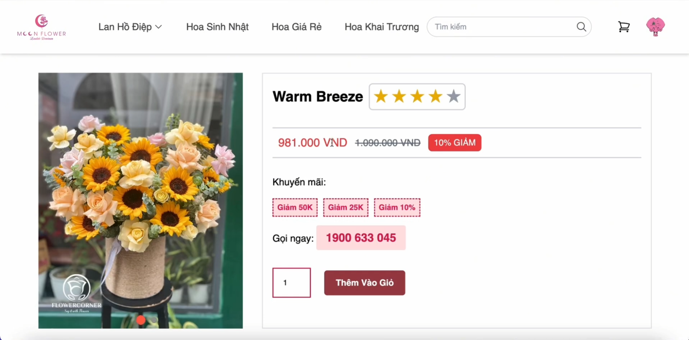
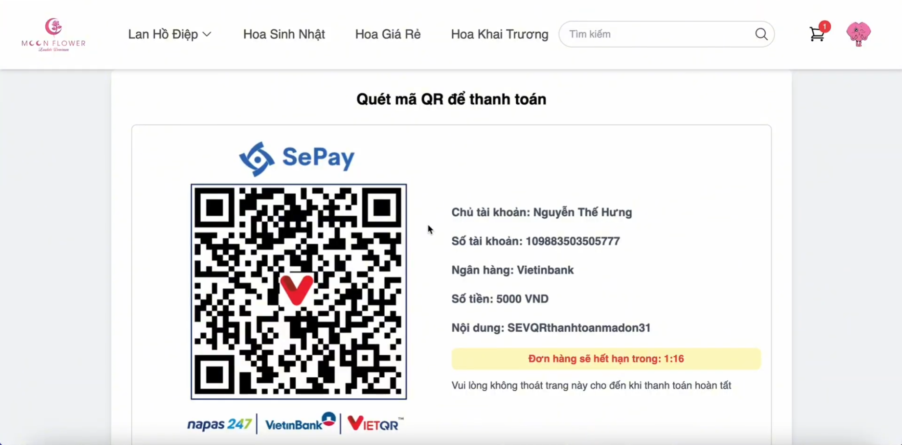
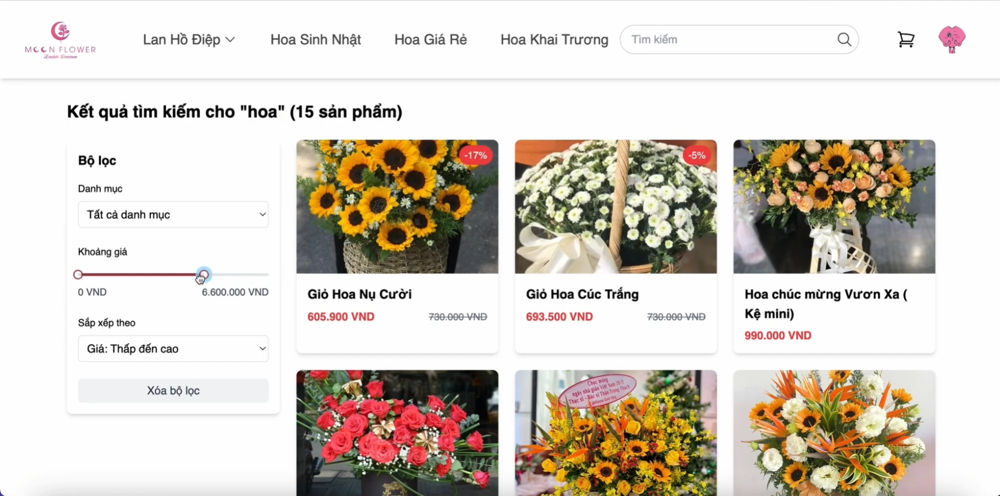
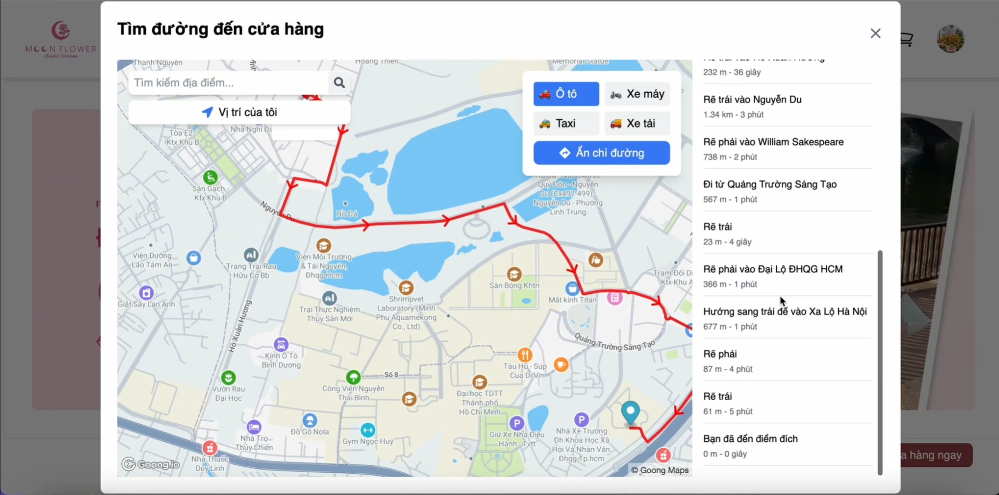

# Flower Store API







## Overview

Flower Store API is a comprehensive backend solution for an e-commerce platform specializing in flower sales. This RESTful API provides all the necessary endpoints to manage products, user accounts, shopping carts, orders, and more.

## Technologies

- **Java 17**
- **Spring Boot 3.3.5**
- **Spring Security** with JWT authentication
- **Spring Data JPA** for database operations
- **MySQL** for persistent data storage
- **Redis** for caching and session management
- **Cloudinary** for image storage
- **Spring Mail** for email notifications
- **Swagger/OpenAPI** for API documentation
- **Docker** for containerization and deployment
- **Maven** for dependency management
- **MapStruct** for object mapping
- **Lombok** for reducing boilerplate code

## Features

### User Management

- User registration and authentication
- JWT-based authentication with refresh tokens
- Role-based access control
- Password reset functionality
- User profile management

### Product Management

- Product creation, update, and deletion
- Product categorization
- Product search and filtering
- Image upload and management via Cloudinary

### Shopping Experience

- Shopping cart functionality
- Address management for shipping
- Order processing and tracking
- Payment integration (placeholder)

### Additional Features

- Email notifications
- Caching with Redis for improved performance
- Comprehensive API documentation with Swagger
- Secure endpoints with proper authorization

## Setup and Installation

### Prerequisites

- Java 17 or higher
- Maven
- Docker and Docker Compose (for containerized deployment)
- MySQL (if running locally)
- Redis (if running locally)

### Environment Configuration

1. Clone the repository
2. Create a `.env` file in the root directory based on the provided `.env.example`
3. Configure the following environment variables:
   - Database credentials
   - JWT secret and expiration times
   - Cloudinary credentials
   - Redis configuration
   - Email service credentials
   - OpenAPI configuration

### Running Locally

```bash
# Build the application
mvn clean install

# Run the application
mvn spring-boot:run
```

### Running with Docker

```bash
# Build and start the containers
docker-compose up -d

# Stop the containers
docker-compose down
```

## API Documentation

Once the application is running, you can access the Swagger UI documentation at:

```
http://localhost:8080/swagger-ui.html
```
